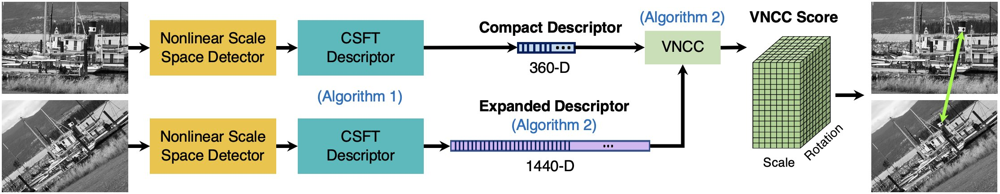

# Compressed Spatial Frequency Transfrom (CSFT)


**Copyright (C) 2018-2022. K. Gao, H. AliAkbarpour, K. Palaniappan and Curators of the University of Missouri, a public corporation.**   
**All Rights Reserved.**  

*For more information, contact:  
Ke Gao, kegao@mail.missouri.edu  
Prof. K. Palaniappan, palaniappank@missouri.edu  
226 Naka Hall  
University of Missouri-Columbia  
Columbia, MO 65211*  


## Description
CSFT is novel feature detection and description approach for robustly matching features across different views suitable for applications such as camera pose estimation and Structure-from-Motion in large scale aerial images. CSFT features are robust across a range of scale and rotation, image blur, varying illumination, and JPEG compression artifacts. The CSFT descriptor is compressed using geometric transformations in the frequency domain that significantly reduce its size. The CSFT feature uses a novel vectorized Normalized Cross Correlation (VNCC) method for matching descriptors. CSFT is a domain independent method that can be easily implemented. CSFT requires no training step compared to the deep learning approaches.  

<p align="center">
  
</p>


## Building CSFT

### Build Library Dependencies   
Before CSFT can be built, several dependencies need to be available on the system.     

- `OpenCV C++ >= 3.4.0`
- `CMake`
- `OpenMP`
- `CUDA (optional)`

`CUDA` is optional but recommended for a better run-time performance. CMake flag `-DNO_CUDA_BUILD` can be used to adjust the build to switch between GPU and CPU implementation as needed. CSFT is built without CUDA when set to `-DNO_CUDA_BUILD=1`. Otherwise, CMake defaults to building with CUDA support when not explicitly specified, i.e., `-DNO_CUDA_BUILD=0`.
 
### Configure and Build   
```
$ cd CSFT
$ mkdir build
$ cd build
$ cmake ..
$ make  
```

## Usage
### Running CSFT
Once CSFT has been successfully built, there should be a executable in the `bin` directory: `CSFT`.  

To run CSFT, go to `./bin/linux` for Linux or `./bin/macos` for MacOS, and invoke `./CSFT <parameters_config_file>`.  
Example usage: `./CSFT ../../params.txt`  

### Description of the CSFT Parameters in Config File
- **img1_fullpath**: path to the 1st input image
- **img2_fullpath**: path to the 2nd input image
- **out_path**: path to the output folder
- **n_keypoints**: number of keypoints to detect per image
- **upright_csft**: flag for using upright-CSFT which disables rotation invariance (1: upright-CSFT, 0: standard-CSFT)
- **flag_export_keypts**: flag for exporting feature keypoints to text files
- **flag_export_desc**: flag for exporting feature descriptors to text files
- **flag_export_match**: flag for exporting feature matches to text files
- **flag_draw_keypts_img**: flag for visualizing feature keypoints on the input images
- **flag_draw_match_img**: flag for visualizing feature matches on the input images  


## Output
The output files will be saved to the directory specified by `out_path` in the parameters config file.
### Visualization
- Images showing the detected keypoints will be saved if `flag_draw_keypts_img` is set to `1`.  
- An image showing the matches will be saved if `flag_draw_match_img` is set to `1`.  

### Text Files
- If `flag_export_keypts` is set to `1`, an ASCII text file containing the keypoints locations (`x y`) will be created for each input image where each row corresponds to a keypoint.   
Example:
```
618.116028 204.111755
437.704346 299.728333
597.402649 202.520157
188.808380 446.749207
437.238708 306.217590
```
- If `flag_export_desc` is set to `1`, an ASCII text file containing the descriptors will be created for each input image where each row corresponds to the descriptor for a keypoint.   
- If `flag_export_match` is set to `1`, an ASCII text file containing the matches (`x1 y1 x2 y2`) will be created for a pair of images where each row corresponds to a match. `x1 y1` and `x2 y2` denote the coordinate of the matched keypoint in the first image and second image, respectively.    
Example:
```
421.005707 304.459961 406.880188 321.907928
409.846680 297.340576 397.476959 325.259186
392.506470 306.396332 393.034668 338.806610
376.126678 328.696777 392.975586 357.134857
437.796295 402.756653 462.513184 370.383728
```

