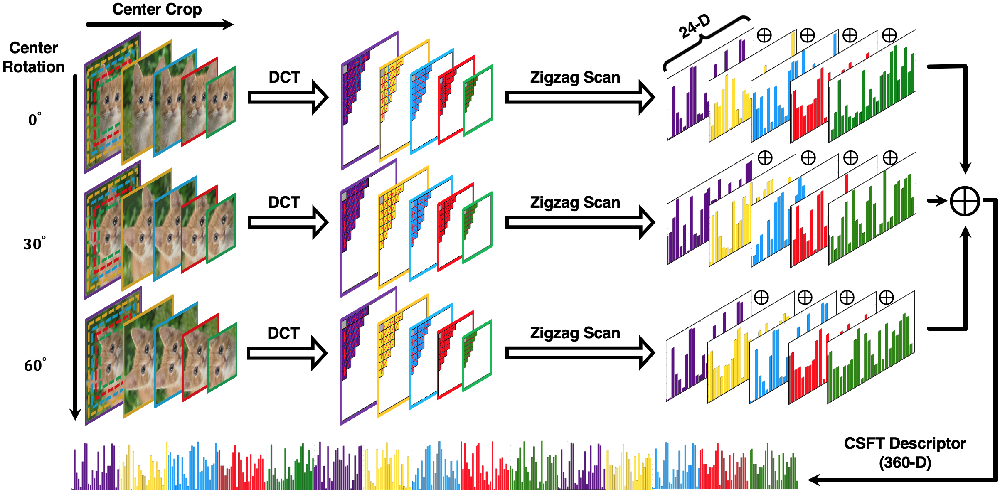

# Compressed Spatial Frequency Transfrom (CSFT)


**Copyright (C) 2018-2022. K. Gao, H. AliAkbarpour, K. Palaniappan and Curators of the University of Missouri, a public corporation.**   
**All Rights Reserved.**  

*For more information, contact:  
Ke Gao, kegao@mail.missouri.edu  
Prof. K. Palaniappan, palaniappank@missouri.edu  
226 Naka Hall  
University of Missouri-Columbia  
Columbia, MO 65211*  


## Description
CSFT is novel feature detection and description approach for robustly matching features across different views suitable for applications such as camera pose estimation and Structure-from-Motion in large scale aerial images. CSFT features are robust across a range of scale and rotation, image blur, varying illumination, and JPEG compression artifacts. The CSFT descriptor is compressed using geometric transformations in the frequency domain that significantly reduce its size. The CSFT feature uses a novel vectorized Normalized Cross Correlation (VNCC) method for matching descriptors. CSFT is a domain independent method that can be easily implemented. CSFT requires no training step compared to the deep learning approaches.  

<p align="center">
  
</p>


## Building CSFT

### Build Library Dependencies   
Before CSFT can be built, several dependencies need to be available on the system:

- `OpenCV C++ >= 3.4.0`
- `CMake`
- `OpenMP`


### Configure and Build   
```
$ cd CSFT
$ mkdir build
$ cd build
$ cmake ..
$ make  
```

## Usage
### Running CSFT
Once CSFT has been successfully built, there should be a executable in the `build` directory: `CSFT`.  

To run CSFT, go to `./bin/linux` for Linux system or `./bin/macos` for MacOS, and invoke `./CSFT <parameters_config_file>`.  
Example usage: `./CSFT ../../params.txt`  

Description of the CSFT parameters config file is shown below.  
- **img1_fullpath**: path to the 1st input image
- **img2_fullpath**: path to the 2nd input image
- **out_path**: path to the output folder
- **n_keypoints**: number of keypoints to detect per image
- **upright_csft**: flag for using upright-CSFT which disables rotation invariance (1: upright-CSFT, 0: standard-CSFT)
- **flag_export_keypts**: flag for exporting feature keypoints to text files
- **flag_export_desc**: flag for exporting feature descriptors to text files
- **flag_export_match**: flag for exporting feature matches to text files
- **flag_draw_keypts_img**: flag for visualizing feature keypoints on the input images
- **flag_draw_match_img**: flag for visualizing feature matches on the input images
